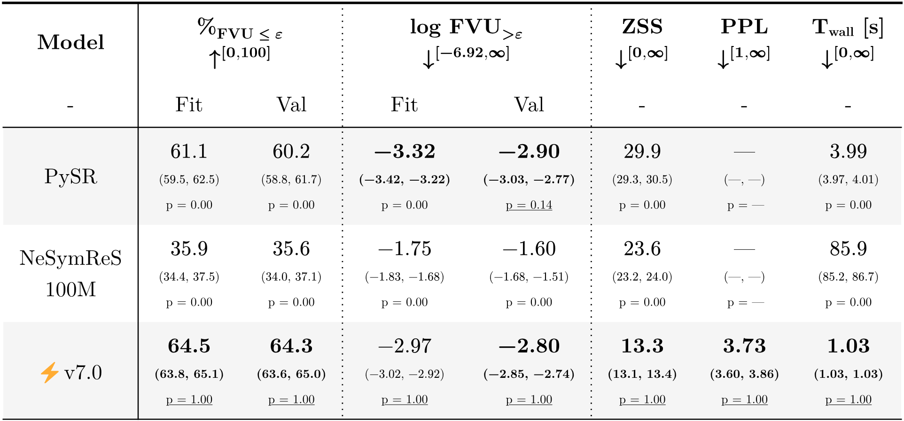

<h1 align="center" style="margin-top: 0px;">⚡ANSR:<br>Flash Amortized Neural Symbolic Regression</h1>

<div align="center">

[](https://github.com/psaegert/flash-ansr/actions/workflows/pytest.yml)
[](https://github.com/psaegert/flash-ansr/actions/workflows/pre-commit.yml)
[](https://github.com/psaegert/flash-ansr/actions/workflows/codeql.yaml)

</div>

<!-- TODO: Visual Abstract -->


> **⚡ANSR Training on Fully Procedurally Generated Data** Inspired by NeSymReS ([Biggio et al. 2021](https://arxiv.org/abs/2106.06427))

# Introduction

### Abstract
Symbolic Regression has been approached with many different methods and paradigms. The overwhelming success of transformer-based language models in recent years has since motivated researchers to solve Symbolic Regression with large-scale pre-training of data-conditioned "equation generators" at competitive levels. However, as most traditional methods, the majority of these Amortized Neural Symbolic Regression methods rely on SymPy to simplify and compile randomly generated training equations, a choice that inevitably brings tradeoffs and requires workarounds to efficiently work at scale. I show that replacing SymPy with a novel token-based simplification algorithm with hand-crafted transformation rules enables training on _fully-procedurally_ generated and _higher-quality_ synthetic data, and thus develop ⚡ANSR. On various test sets, my method perfectly recovers $+80$% more equations numerically than the NeSymReS baseline while being 84 times faster natively, and yields comparable recovery rates to PySR in a quarter of its time. I provide an in-depth performance analysis of my method on stricter and more meaningful metrics than previous work. ⚡ANSR is open-source and available on GitHub and Huggingface, and allows for straight-forward replicability on consumer-grade hardware.

### Main Results


> **Model Comparison.** Up to 3 variables. Default Model Configurations (32 threads / beams).\
> Bootstrapped Median, 5p, 95p and AR-p ([Noreen 1989](https://scholar.google.com/scholar?hl=en&q=Computer-intensive+methods+for+testing+hypotheses)) values (n=1000).\
> N = 5000 ([⚡ v7.0](#usage)), 1000 ([PySR](https://github.com/MilesCranmer/PySR), [NeSymReS 100M](https://github.com/SymposiumOrganization/NeuralSymbolicRegressionThatScales?tab=readme-ov-file#pretrained-models)).\
> AMD 9950X (16C32T), RTX 4090.

# Table of Contents
- [Introduction](#introduction)
    - [Abstract](#abstract)
    - [Main Results](#main-results)
- [Table of Contents](#table-of-contents)
- [Requirements](#requirements)
  - [Hardware](#hardware)
  - [Software](#software)
- [Getting Started](#getting-started)
  - [1. Clone the repository](#1-clone-the-repository)
  - [2. Install the package](#2-install-the-package)
- [Usage](#usage)
- [Training](#training)
  - [Express](#express)
  - [Manual](#manual)
    - [0. Prerequisites](#0-prerequisites)
    - [1. Import test data](#1-import-test-data)
    - [2. Generate validation data](#2-generate-validation-data)
    - [3. Train the model](#3-train-the-model)
    - [4. Evaluate the model](#4-evaluate-the-model)
      - [4.1 Config-driven workflow](#41-config-driven-workflow)
      - [4.2 Example run configs](#42-example-run-configs)
        - [4.2.1 FlashANSR on curated sets](#421-flashansr-on-curated-sets)
        - [4.2.2 FastSRB benchmark](#422-fastsrb-benchmark)
        - [4.2.3 PySR baseline](#423-pysr-baseline)
        - [4.2.4 NeSymReS baseline](#424-nesymres-baseline)
      - [4.3 Legacy CLI commands](#43-legacy-cli-commands)
- [Development](#development)
  - [Setup](#setup)
  - [Tests](#tests)
- [Citation](#citation)

# Requirements

## Hardware
- `32` GB Memory
- CUDA-enabled GPU
- `12` GB VRAM
- `64` GB Storage (subject to change)

## Software
- Python $\geq$ 3.10
- `pip` $\geq$ 21.3 with PEP 660 (see https://pip.pypa.io/en/stable/news/#v21-3)
- (Ubuntu 22.04.3 LTS)

# Getting Started
## 1. Clone the repository

```sh
git clone https://github.com/psaegert/flash-ansr
cd flash-ansr
```

## 2. Install the package

Create a virtual environment (optional):

**conda:**

```sh
conda create -n flash_ansr python=3.13 ipykernel ipywidgets
conda activate flash_ansr
```

Then, install the package with

```sh
pip install -e .
```

# Usage

```python
import torch
device = torch.device("cuda" if torch.cuda.is_available() else "cpu")

# Import flash_ansr
from flash_ansr import FlashANSR, SoftmaxSamplingConfig, install_model, get_path

# Specify the model
# Here: https://huggingface.co/psaegert/flash-ansr-v21.0-60M
MODEL = "psaegert/flash-ansr-v21.0-60M"

# Download the latest snapshot of the model
# By default, the model is downloaded to the directory `./models/` in the package root
install_model(MODEL)

# Load the model
ansr = FlashANSR.load(
    directory=get_path('models', MODEL),
    generation_config=SoftmaxSamplingConfig(choices=32),  # optional
    n_restarts=8,  # optional
).to(device)

# Define data
X = ...
y = ...

# Fit the model to the data
ansr.fit(X, y, verbose=True)

# Show the best expression
print(ansr.get_expression())

# Predict with the best expression
y_pred = ansr.predict(X)
```


# Training

## Express

Use, copy or modify a config in `./configs`:

```
./configs
├── my_config
│   ├── dataset_train.yaml          # Link to skeleton pool and padding for training
│   ├── dataset_val.yaml            # Link to skeleton pool and padding for validation
│   ├── tokenizer.yaml              # Tokenizer settings
│   ├── model.yaml                  # Model settings and link to simplipy engine
│   ├── skeleton_pool_train.yaml    # Sampling and holdout settings for training
│   ├── skeleton_pool_val.yaml      # Sampling and holdout settings for validation
│   └── train.yaml                  # Data and schedule for training
```

Use the helper scripts to import data, build validation sets, and kick off training:

```sh
./scripts/import_test_sets.sh                     # optional, required only once per checkout
./scripts/generate_validation_set.sh my_config    # prepares validation skeletons
./scripts/train.sh my_config                      # trains using configs/my_config
```

For more information see below.

## Manual

### 0. Prerequisites

Test data structured as follows:

```sh
./data/ansr-data/test_set
├── feynman
│   └── FeynmanEquations.csv
├── nguyen
│   └── nguyen.csv
└── soose_nc
    └── nc.csv
```

The test data can be cloned from the Hugging Face data repository:

```sh
git clone https://huggingface.co/psaegert/ansr-data data/ansr-data
```

### 1. Import test data

External datasets must be imported into the ANSR format:

```sh
flash_ansr import-data -i "{{ROOT}}/data/ansr-data/test_set/soose_nc/nc.csv" -p "soose" -e "dev_7-3" -b "{{ROOT}}/configs/test_set/skeleton_pool.yaml" -o "{{ROOT}}/data/ansr-data/test_set/soose_nc/skeleton_pool" -v
flash_ansr import-data -i "{{ROOT}}/data/ansr-data/test_set/feynman/FeynmanEquations.csv" -p "feynman" -e "dev_7-3" -b "{{ROOT}}/configs/test_set/skeleton_pool.yaml" -o "{{ROOT}}/data/ansr-data/test_set/feynman/skeleton_pool" -v
flash_ansr import-data -i "{{ROOT}}/data/ansr-data/test_set/nguyen/nguyen.csv" -p "nguyen" -e "dev_7-3" -b "{{ROOT}}/configs/test_set/skeleton_pool.yaml" -o "{{ROOT}}/data/ansr-data/test_set/nguyen/skeleton_pool" -v
```

with

- `-i` the input file

- `-p` the name of the parser implemented in `./src/flash_ansr/compat/convert_data.py`

- `-e` the SimpliPy engine version to use for simplification

- `-b` the config of a base skeleton pool to add the data to

- `-o` the output directory for the resulting skeleton pool

- `-v` verbose output

This will create and save a skeleton pool with the parsed imported skeletons in the specified directory:

```sh
./data/ansr-data/test_set/<test_set>
└── skeleton_pool
    ├── skeleton_pool.yaml
    └── skeletons.pkl
```

### 2. Generate validation data

Validation data is generated by randomly sampling according to the settings in the skeleton pool config:

```sh
flash_ansr generate-skeleton-pool -c {{ROOT}}/configs/${CONFIG}/skeleton_pool_val.yaml -o {{ROOT}}/data/ansr-data/${CONFIG}/skeleton_pool_val -s 5000 -v
```

with

- `-c` the skeleton pool config
- `-o` the output directory to save the skeleton pool
- `-s` the number of unique skeletons to sample
- `-v` verbose output

### 3. Train the model

```sh
flash_ansr train -c {{ROOT}}/configs/${CONFIG}/train.yaml -o {{ROOT}}/models/ansr-models/${CONFIG} -v -ci 100000 -vi 10000
```

with

- `-c` the training config
- `-o` the output directory to save the model and checkpoints
- `-v` verbose output
- `-ci` the interval to save checkpoints
- `-vi` the interval for validation

### 4. Evaluate the model

⚡ANSR, PySR, NeSymReS, and the FastSRB benchmark now run through a shared evaluation engine. Each run is configured in a single YAML that wires a **data source**, a **model adapter**, and runtime **runner** settings. The new CLI subcommand looks like this:

```sh
flash_ansr evaluate-run -c configs/evaluation/run_flash_ansr_nguyen.yaml -v
```

Use `-n/--limit`, `--save-every`, `-o/--output-file`, `--experiment <name>`, or `--no-resume` to temporarily override the config without editing the file. Multi-experiment files (see `configs/evaluation/scaling/`) require `--experiment` to pick the exact sweep entry.

#### 4.1 Config-driven workflow

Every run config (see `configs/evaluation/*.yaml`) follows the same structure:

```yaml
run:
  data_source:  # how to create evaluation samples
    ...
  model_adapter:  # which model/baseline to call
    ...
  runner:        # bookkeeping + persistence
    limit: 5000
    save_every: 250
    output: "{{ROOT}}/results/evaluation/v22.4-60M/nguyen.pkl"
    resume: true
```

- **`data_source`** selects where problems come from. `type: skeleton_dataset` streams from a `FlashANSRDataset`, while `type: fastsrb` reads the FastSRB YAML benchmark. Common knobs include `n_support`, `noise_level`, and target sizes. Provide `datasets_per_expression` to iterate each skeleton or FastSRB equation deterministically with a fixed number of generated datasets (handy for reproducible evaluation sweeps).
- **`model_adapter`** declares the solver. Supported values today are `flash_ansr`, `pysr`, and `nesymres`, each with their own required fields (model paths, timeout, beam width, etc.).
- **`runner`** controls persistence: `limit` caps the number of processed samples, `save_every` checkpoints incremental progress to `output`, and `resume` decides whether to load previous results from that file.

Running `flash_ansr evaluate-run ...` loads the config, resumes any previously saved pickle, instantiates the requested data/model pair, and streams results back into the same output file.

#### 4.2 Example run configs

Ready-to-use configs for the most common set-ups live under `configs/evaluation/`. Adjust the dataset/model paths as needed.

##### 4.2.1 FlashANSR on curated sets

`configs/evaluation/run_flash_ansr_nguyen.yaml` evaluates a FlashANSR checkpoint on the Nguyen test set with `n_support=512` and writes `results/evaluation/v22.4-60M/nguyen.pkl`. Run it with:

```sh
flash_ansr evaluate-run -c configs/evaluation/run_flash_ansr_nguyen.yaml -v
```

Update the dataset path or the `runner.limit` to sweep different test suites without touching the CLI.

##### 4.2.2 FastSRB benchmark

`configs/evaluation/run_fastsrb.yaml` feeds the FastSRB YAML benchmark through the same FlashANSR model (2 draws per equation, 512 support points). Launch it via:

```sh
flash_ansr evaluate-run -c configs/evaluation/run_fastsrb.yaml -v
```

Tweak `data_source.datasets_per_expression`, `eq_ids`, or `noise_level` inside the YAML to match your experiment.

##### 4.2.3 PySR baseline

1. Install [PySR](https://github.com/MilesCranmer/PySR) alongside flash-ansr in the active environment.
2. Use `configs/evaluation/run_pysr_nguyen.yaml` to mirror the Nguyen evaluation protocol (timeout 60 s, 100 iterations, parsimony 1e-3).
3. Launch the run:

   ```sh
   flash_ansr evaluate-run -c configs/evaluation/run_pysr_nguyen.yaml -v
   ```

The config automatically reuses the dataset's bundled SimpliPy engine; provide `model_adapter.simplipy_engine` in the YAML if you need an explicit override.

##### 4.2.4 NeSymReS baseline

1. Clone [NeuralSymbolicRegressionThatScales](https://github.com/SymposiumOrganization/NeuralSymbolicRegressionThatScales) and download the `100M` checkpoint as described in their README.
2. Install flash-ansr and NeSymReS (see their instructions: `pip install -e src/ && pip install lightning`).
3. Update `configs/evaluation/run_nesymres.yaml` so `eq_setting_path`, `config_path`, and `weights_path` point to your checkout, and adjust the output location if desired.
4. Run the evaluation:

   ```sh
   flash_ansr evaluate-run -c configs/evaluation/run_nesymres.yaml -v
   ```

The adapter handles SimpliPy compilation (`simplipy_engine: "dev_7-3"` by default) and exposes `beam_width`/`n_restarts` knobs inside the config.

##### 4.2.5 Compute-scaling sweeps

New multi-experiment configs under `configs/evaluation/scaling/` capture the compute-scaling curves requested for ⚡ANSR, PySR, and NeSymReS on both FastSRB and the `v23.x` validation skeleton pool. Each file defines a set of named experiments (`flash_ansr_fastsrb_choices_00032`, `pysr_v23_iter_08192`, `nesymres_fastsrb_beam_00128`, …) that vary the relevant runtime parameter:

- **FlashANSR**: `generation_overrides.kwargs.choices` steps from 1 → 16,384 using SoftmaxSampling.
- **PySR**: `niterations` mirrors the same powers-of-two sweep.
- **NeSymReS**: `beam_width` ranges from 1 → 256.

Select any entry via `--experiment` without copying the YAML. For example, to run FlashANSR on FastSRB with 1,024 choices:

```sh
flash_ansr evaluate-run \
  -c configs/evaluation/scaling/flash_ansr_fastsrb.yaml \
  --experiment flash_ansr_fastsrb_choices_01024 -v
```

Outputs are namespaced under `results/evaluation/scaling/<model>/<dataset>/...` so sweeps can run back-to-back.

#### 4.3 Legacy CLI commands

The historical subcommands (`flash_ansr evaluate`, `evaluate-fastsrb`, `evaluate-pysr`, `evaluate-nesymres`) continue to work, but they are now thin shims around the new engine and will be retired in a future release. Prefer `flash_ansr evaluate-run` plus a run config so every tool—⚡ANSR, PySR, NeSymReS, or FastSRB—shares a single, reproducible entry point.

# Development

## Setup
To set up the development environment, run the following commands:

```sh
pip install -e .[dev]
pre-commit install
```

## Tests

Test the package with `./scripts/pytest.sh`. Run pylint with `./scripts/pylint.sh`.

# Citation
```bibtex
@software{flash-ansr2024,
    author = {Paul Saegert},
    title = {Flash Amortized Neural Symbolic Regression},
    year = 2024,
    publisher = {GitHub},
    version = {0.4.0},
    url = {https://github.com/psaegert/flash-ansr}
}
```
